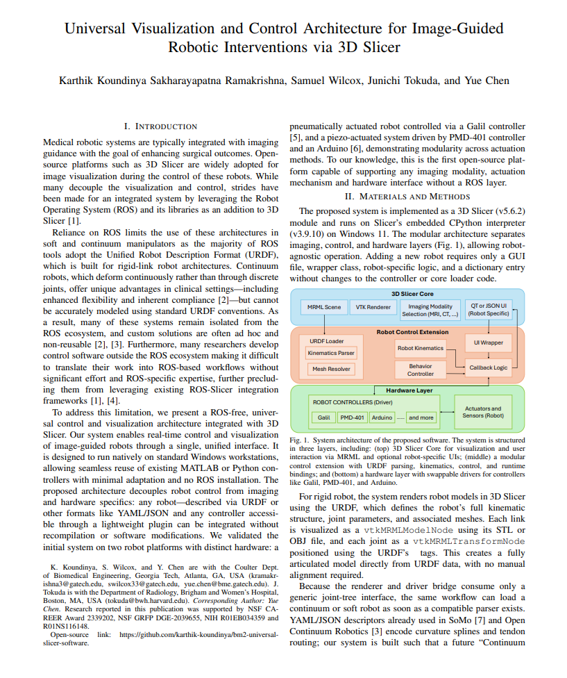
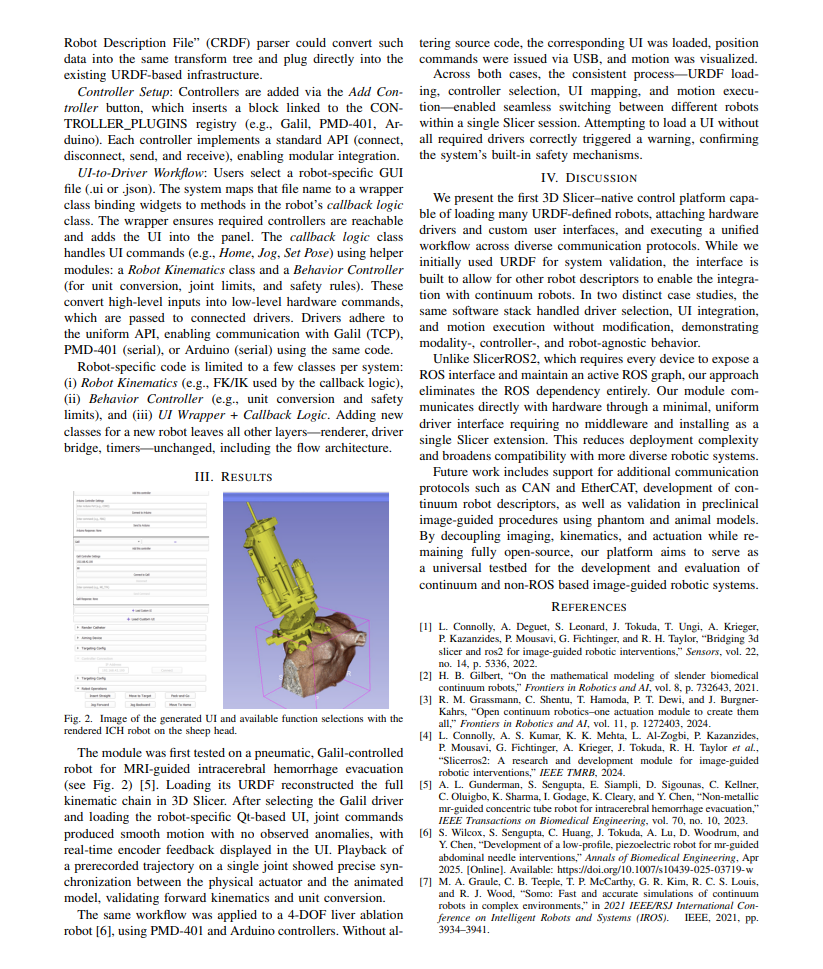

# BM2 Universal Slicer Software

A detailed explanation of the architecture is available in our submission to the ICRA 2025 Workshop – Ubiquitous Medical Robotics: Lessons Learned, Vision Beyond: https://sites.google.com/view/umedbot/home   

Arduino driver code has been adopted from https://github.com/pzaffino/SlicerArduinoController 
